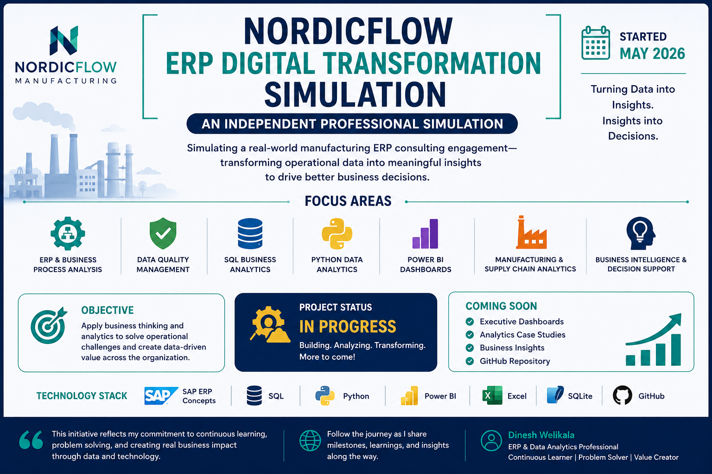

# NordicFlow ERP Digital Transformation Simulation
### An Independent ERP, Data Analytics & Business Intelligence Consulting Journey

## Project Status

🚧 **In Progress**

**Started:** May 2026

NordicFlow is an independent professional simulation designed to replicate the analytical and consulting challenges of a manufacturing ERP environment.

Rather than developing isolated technical exercises, the initiative connects ERP business processes, data quality, analytics and business intelligence into one evolving business scenario.

The objective is to explore how operational ERP data can be transformed into reliable information, business insights and better management decisions.

---

## Focus Areas

- ERP & Business Process Analysis
- Data Quality Management
- SQL Business Analytics
- Python Data Analytics
- Power BI & Business Intelligence
- Inventory & Working Capital
- Procurement & Supplier Performance
- Production Performance
- Executive Decision Support

---

## Technology Stack

`ERP Concepts` · `Excel` · `SQL` · `SQLite` · `Python` · `pandas` · `Power BI` · `GitHub`

---

## Current Journey

Several analytical workstreams have already been developed within the simulation, covering:

- ERP data preparation and quality control
- relational database analysis
- inventory risk identification
- supplier performance analysis
- production performance analysis
- automated Python analytics
- executive KPI development

The Business Intelligence phase is currently under development.

Selected technical deliverables and business findings will be released progressively as the simulation develops.

---

## Consulting Approach

The simulation follows a simple principle:

**Business Understanding → Reliable Data → Analytics → Insight → Decision**

The focus is not only on using technical tools, but on understanding why a business problem exists, identifying the relevant ERP data, validating the evidence and translating the results into actionable recommendations.

---

## Coming Soon

- Interactive Power BI dashboards
- ERP analytics case studies
- selected SQL and Python implementations
- executive business insights
- consulting recommendations
- complete end-to-end case study

---

## Portfolio Projects

### Project 03 — Excel Data Engineering
Data preparation, data-quality controls and cleansing workflow.

### Project 04 — SQL Business Analysis
Relational ERP analysis across inventory, procurement and production.

### Project 05 — Python ERP Analytics
Automated business analytics, exception detection and management reporting.

### Project 06 — Power BI Executive Dashboard
**Currently in progress.**

Interactive business intelligence and executive decision-support layer.

---

## Important Disclosure

NordicFlow Manufacturing and the associated business data are fictional.

This repository represents an **independent professional simulation** developed to strengthen practical ERP, Data Analytics, Business Intelligence and consulting capabilities. It should not be interpreted as a production implementation for a real client.

---

## Follow the Journey

The repository will continue evolving as additional milestones, analytics and business insights are completed.

**Turning data into insights. Insights into decisions.**
